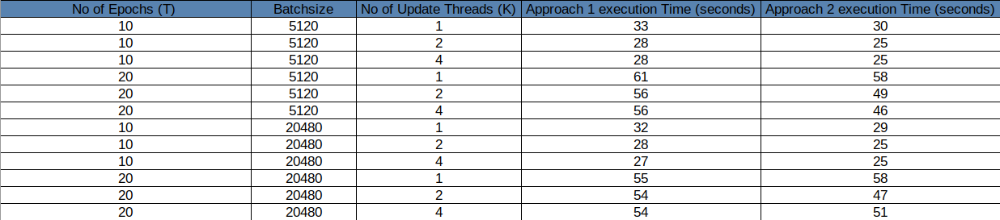

# Multi-threaded training of Logistic Regression Model using Stochastic Gradient Descent

Dataset used - [covtype.binary](https://www.csie.ntu.edu.tw/~cjlin/libsvmtools/datasets/binary.html)

## Approach 1
In this approach the threads used are:

* 1 - data reading thread, which takes a data reading request from other gradient update threads and reads
a minibatch of data to a buffer in memory.

* A pool of k - gradient update threads which takes a minibatch from the memory and computes the
update to parameters.

* 1 - Main thread which coordinates the updates from various gradient update threads.

## Approach 2
In this approach the threads used are:

* A pool of k – data reading and gradient update threads which reads a minibatch of data to a buffer in
memory and computes the update to parameters. We call these worker threads.

* 1 - Main thread which coordinates the updates from various worker threads.

## Results

